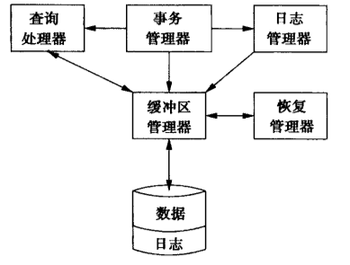

###故障模式

##### 错误数据输入

不能被检测到的错误。

##### 介质故障

磁盘的局部故障，即只改变一位或少数几位的故障，通常能通过与磁盘扇区相关联的奇偶。

磁头损坏，使整个磁盘都不再能够访问，这时通过下述方法中的一个或两个来处理：

1. 采用某种RAID模式，这样丢失的数据就可以被恢复。
2. 维护一个备份。
3. 可以采用联机保存数据库的冗余拷贝。

##### 灾难性故障

这类故障包括容纳数据库的介质完全损坏的多种情况，例如数据库所在节点被破坏。RAID不会带来任何帮助，但是备份、冗余、分布式拷贝可以防范。

#####系统故障

查询和修改数据库的进程称为**事务**。事务和其他任何程序一样执行一系列步骤，通常步骤中的一部分将修改数据库。每个事务有一个状态，代表该事务中到目前为止已发生什么。状态包括所执行事务代码中的当前位置和所有以后将会需要的事务局部变量的值。

**系统故障**是导致事务状态丢失的问题，典型的系统故障包括掉电和软件错误。

### 关于事务的进一步讨论

**事务**是数据库执行操作的单位。

保证事务正确执行是事务管理器的工作，这一子系统的功能包括：

1. 给日志管理器发信号，使必须的信息能以“日志记录”的形式存储在日志中。
2. 保证并发执行的事务不会以引入错误的方式互相干扰。

事务管理器将关于事务动作的消息传给日志管理器，将关于何时可以或必须将缓冲区拷贝回磁盘的消息传给缓冲区管理器，并传消息给查询处理器使之能执行查询以及其他构成事务的数据库操作。

日志管理器维护日志。日志管理器必须同缓冲区管理器打交道，因为日志的空间最初出现在主存缓冲区中，在一定的时候这些缓冲区必须被拷贝到磁盘上。

发生崩溃时，恢复管理器就被激活，恢复管理器检查日志并在必要时利用日志恢复数据。




###事务的正确执行

不同的数据库系统使用不同的元素概念，它们常常是以下的一个或多个：

1. 关系。

2. 磁盘块或页。

3. 关系中的单个元组或对象。

数据库具有**状态**，即对应其各个元素的取值。

关于事务的一个基本假设是：

* **正确性原则**：如果事务在没有其他任何事务和系统错误的情况下执行，并且在它开始执行时数据库处于一致的状态，那么当事务结束时数据库仍然处于一致的状态。

正确性原则另一种表述方式包括两点：
1. 事务是原子的；即事务必须作为整体执行或者根本不执行。如果仅有事务的部分被执行，那么很有可能所产生的数据库状态是不一致的。
2. 事务的同时执行可能导致状态的不一致，除非我们设法控制他们之间的相互影响。

###事务的元语操作

有3个地址空间，它们在重要的方面相互影响：

1. 保存数据库元素的磁盘块空间。
2. 缓冲区管理器所管理的虚拟内存或主存地址空间。
3. 事务的局部地址空间。

事务要读取数据库元素，该元素首先必须被读取到主存的一个或多个缓冲区中。接下来，缓冲区中的内容可以被事务读取到其局部地址空间中。事务为数据库元素写入一个新值的过程与此相反。事务首先在自己的局部空间中创建新值，然后该值被拷贝到适当的缓冲区中。

使用以下元语描述数据在地址空间中的移动：
1. $INPUT(X)$：将包含数据库元素$X$的磁盘块拷贝到主存缓冲区。
2. $READ(X, t)$：将数据库元素$X$拷贝到事务的局部变量$t$。如果包含数据库元素$X$的块不在主存缓冲区中，则首先执行$INPUT(X)$，接着将$X$的值赋给局部变量$t$。
3. $WHERE(X, t)$：将局部变量$t$的值拷贝到主存缓冲区中的数据库元素$X$。如果包含数据库元素$X$的块不在主存缓冲区中，则首先执行$INPUT(X)$，接着将$t$的值拷贝到缓冲区中的$X$。
4. $OUTPUT(X)$：将包含$X$的缓冲区中的块拷贝回磁盘。

假定：

* 数据库元素的大小不超过一个块。

$READ$和$WRITE$由事务发出。$INPUT$和$OUTPUT$通常由缓冲区管理器发出。某些情况下$OUTPUT$也能由日志管理器发出。

例：数据库中包含两个元素$A$和$B$，这两个元素要满足的约束是在任何一致的状态中它们的值相等。

事务$T$逻辑上由下述两步构成
$$
A := A * 2; \\
B := B * 2;
$$
$T$的执行包括从磁盘读$A$和$B$，在$T$的局部变量中执行算术运算，以及将$A$和$B$的新值写入其缓冲区中。

$T$可表述为6个相关步骤的序列：
```
READ(A, t);
t := t * 2;
WHERE(A, t);
READ(B, t);
t := t * 2;
WHERE(B, t);
```

此外缓冲区管理器最终将执行$OUTPUT$步骤

假设最初$A = B = 8$

|     动作      | $t$  | 内存中的$A$ | 内存中的$B$ | 磁盘中的$A$ | 磁盘中的$B$ |
| :-----------: | :--: | :---------: | :---------: | :---------: | :---------: |
| $READ(A, t)$  | $8$  |     $8$     |             |     $8$     |     $8$     |
| $t := t * 2$  | $16$ |     $8$     |             |     $8$     |     $8$     |
| $WHERE(A, t)$ | $16$ |    $16$     |             |     $8$     |     $8$     |
| $READ(B, t)$  | $8$  |    $16$     |     $8$     |     $8$     |     $8$     |
| $t := t * 2$  | $16$ |    $16$     |     $8$     |     $8$     |     $8$     |
| $WHERE(B, t)$ | $16$ |    $16$     |    $16$     |     $8$     |     $8$     |
|  $OUTPUT(A)$  | $16$ |    $16$     |    $16$     |    $16$     |     $8$     |
|  $OUTPUT(B)$  | $16$ |    $16$     |    $16$     |    $16$     |    $16$     |

如果系统故障在$OUPTUT(A)$和$OUTPUT(B)$之间发生，则会不一致。