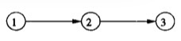

### 冲突

假设$T_i$和$T_j$是不同的事务，即$i\ne j$
大部分动作**不冲突**

1. $r_i(X)$ $r_j(Y)$不冲突，即使$X=Y$
2. $r_i(X)$ $w_j(Y)$不冲突，只要$X\ne Y$
3. $w_i(X)$ $w_j(Y)$不冲突，只要$X\ne Y$

有三种情况不能交换动作的顺讯
1. 同一事务的两个动作，如$r_i(X)$和$w_i(Y)$总是冲突的
2. 不同事务对同一数据库元素的写冲突。$w_i(X)$和$w_j(X)$是一个冲突。
3. 不同事务对同一数据库元素的读和写冲突。$w_i(X)$和$r_j(X)$是一个冲突。

综上，不同事务的两个动作可以交换，除以下情况：
1. 它们涉及同一个数据库元素。
2. 至少有一个动作是写。

如果通过一系列相邻动作的非冲突交换能将它们中的一个转换为另一个，则两个调度是**冲突等价**的。如果一个调度冲突等价于一个串行调度，那么我们说该调度是**冲突可串行化**的。

例：考虑调度
$$
r_1(A);w_1(A);r_2(A);w_2(A);r_1(B);w_1(B);r_2(B);w_2(B)
$$
我们说这个调度是可串行化的。
$$
r_1(A);w_1(A);r_2(A);\underline{w_2(A)};\underline{r_1(B)};w_1(B);r_2(B);w_2(B) \\
r_1(A);w_1(A);\underline{r_2(A)};\underline{r_1(B)};w_2(A);w_1(B);r_2(B);w_2(B) \\
r_1(A);w_1(A);r_1(B);r_2(A);\underline{w_2(A)};\underline{w_1(B)};r_2(B);w_2(B) \\
r_1(A);w_1(A);r_1(B);\underline{r_2(A)};\underline{w_1(B)};w_2(A);r_2(B);w_2(B) \\
r_1(A);w_1(A);r_1(B);w_1(B);r_2(A);w_2(A);r_2(B);w_2(B)
$$

### 优先图及冲突可串行化判断

已知调度$S$，其中涉及事务$T_1$和$T_2$，可能还有其他事务。我们说$T_1$优先于$T_2$，写作$T_1 <_S T_2$，如果有$T_1$的动作$A_1$和$T_2$的动作$A_2$，满足：
1. 在$S$中$A_1$在$A_2$前。
2. $A_1$和$A_2$都涉及同一数据库元素。
3. $A_1$和$A_2$至少有一个是写动作。

这是我们不能交换$A_1$和$A_2$顺序的情况。因此，在任何冲突等价于$S$的调度中$A_1$将出现在$A_2$前。所以，冲突等价的串行调度必然使$T_1$在$T_2$前。
我们可以在**优先图**中概括这样的先后顺序。优先图的节点是调度$S$中的事务。当这些事务是具有不同的$i$的$T_i$时，我们仅用整数$i$来标记$T_i$的节点。如果$T_1 <_S T_j$，则有一条从节点$i$到节点$j$的弧。
例：下面的调度$S$涉及三个事务$T_1$、$T_2$和$T_3$。
$$
S:r_2(A);r_1(B);w_2(A);r_3(A);w_1(B);w_3(A);r_2(B);w_2(B);
$$
$S$中$r_2(A)$在$w_3(A)$之前，而$w_2(A)$既在$r_3(A)$又在$w_3(A)$之前。所以$T_2 <_S T_3$
$r_1(B)$在$w_2(B)$之前，所以$T_1 <_S T_2$。

优先图如下所示：

如果$S$的优先图有环，那么$S$不是可冲突串行化的。如果无环，则$S$是可冲突串行化的，而且节点的任何一个拓扑顺序都是一个冲突等价的串行顺序。

#### 为什么冲突可串行化对于可串行化来说不是必要的

考虑事务$T_1$、$T_2$和$T_3$。一个可能的，恰好是串行的调度是：
$$
S_1:w_1(Y);w_1(X);w_2(Y);w_2(X);w_3(X); \\
S_2:w_1(Y);w_2(Y);w_2(X);w_1(X);w_3(X);
$$
$S_1$和$S_2$的结果是一样的，但是不能通过交换将$S_2$转换为串行调度。$S_2$是可串行化的，但不是冲突可串行化的。

###优先图测试发挥作用的原因

略
