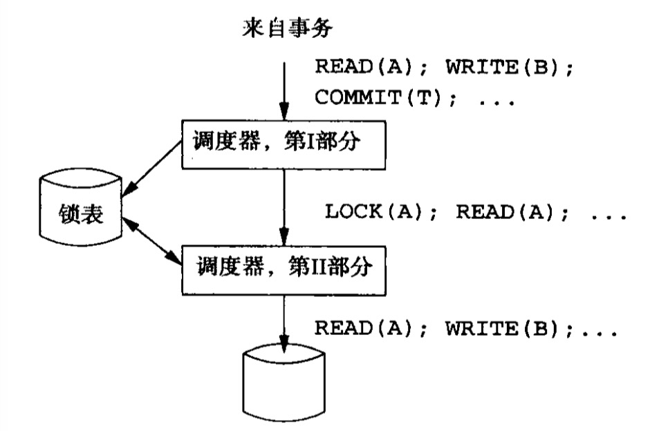
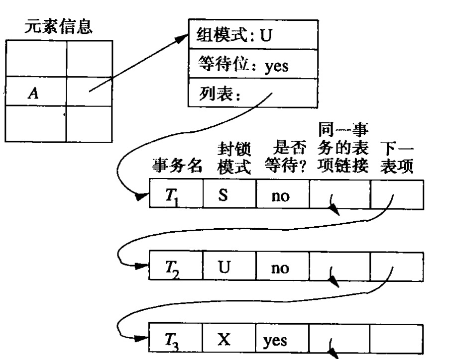

## 封锁调度器的一种体系结果

### 原则

1. 事务自身不会申请封锁，或我们不能依赖于事务做这件事。在读、写以及其他访问数据的动作流中插入锁的动作是调度器的任务。

2. 事务不释放锁，而是调度器在食物管理器告诉它事务将提交或中止时释放锁。

###插入锁动作的调度器

图示为一个由两部分构成的调度器，它接受来自事务的诸如读、写、提交以及中止这样的请求。调度器维护一个锁表，通常锁表使用的的内存不是用于查询执行和日志的缓冲池的一部分。锁表是DBMS的一部分，并且像DBMS的其他代码和数据那样由操作系统为其分配空间。

事务请求的动作通常通过调度器传送并在数据库上执行。但是某些情况下，事务等待一个锁而被推迟，其请求暂时不被传送到数据库。调度器的两个部分执行如下动作：
1. 第$I$部分接受事务产生的数据流，并在所有数据库访问操作如读、写、增量和更新前插入适当的锁动作。数据库访问操作被传送到第$II$部分。不管调度器是用什么样的封锁模式集合，调度器的第$I$部分必须从其中选择适当的封锁方式。
2. 第$II$部分接受由第$I$部分传来的封锁和数据库访问动作序列，并执行。如果第$II$部分接收到一个封锁或数据库访问请求，那么它要决定提出请求的事务$T$是否因为某个锁不能获得而被推迟。如果被推迟，这个动作加入一个最终必须为事务$T$执行的动作列表中。如果$T$不被推迟(即获得所有锁)，那么
   1. 如果动作是数据库访问，这一动作被传送到数据库并被执行。
   2. 如果第$II$部分收到一个封锁动作，它将查看锁表以决定表是否能被授予。
      1. 如果是，修改锁表，将刚刚授予的锁包括进去。
      2. 如果不是，那么锁表中必须加入一项以表明该锁已经被申请。调度器的第$II$部分接着推迟事务$T$直到锁被授予时。
3. 当事务$T$提交或中止时，事务管理器将通知第$I$部分，第$I$部分于是释放$T$所持有的所有的锁。如果有事务等待这些锁中的任何一个，第$I$部分将通知第$II$部分。
4. 当第$II$部分被告知某个数据库元素$X$上的锁可以获得时，它决定接下来能获得该锁的一个或多个事务。获得锁的这个或这些事务被允许尽可能多的执行它们被推迟的动作，直到它或它们完成或达到另一个不能被授予的封锁请求。

###锁表

锁表是将数据库元素与有关该元素的封锁信息联系起来的一个关联表。这个表可以用一个散列表来表示，使用数据库元素地址作为散列码。任何未被封锁的元素在表中不出现，因此表的大小只与被封锁元素的数目成正比。

1. **组模式**概括事务申请$A$上的一个新锁时所面临的最苛刻的条件。在共享-排他-更新(SXU)模式中，组模式
   1. $S$代表被持有的为共享锁
   2. $U$代表有一个更新锁，可能有一个或多个共享锁
   3. $X$代表有一个排他锁，并且没有其他的锁。

2. **等待位**说明至少有一个事务等待$A$上的锁。

3. 列表描述了所有在$A$上持有锁，或者等待$A$上的锁的那些事务，每个列表信息包括：

   1. 持有锁或等待锁的事务名。

   2. 该锁的方式。

   3. 事务是持有锁还是等待锁。

####封锁请求的处理

假设事务$T$请求$A$上的锁。如果没有$A$的锁表项，那么在$A$上肯定无锁，于是创建相应表项并且同意封锁请求。

如果存在$A$的锁表项：找到组模式，根据组模式判断是否可以授予锁，并更新列表。

####解锁的处理

假设事务$T$解锁$A$，列表中$T$关于$A$的项被删除。如果$T$持有的锁与组模式不同，则不需要改变组模式。否则根据列表改变组模式
如果等待位置位，则需要授予申请列表中的一个或多个锁。
1. **先来先服务**，这种策略保证不会**饥饿**
2. **共享锁优先**，首先授予所有等待的共享锁。如果有等待的更新锁，则授予一个更新锁。只有在没有其他锁等待时才授予排他锁。这一策略允许等待$U$或$X$的事务饥饿。
3. **升级优先**，如果一个持有$U$锁的事务等待将其升级为$X$锁，则首先授予该锁。否则，使用其他策略。