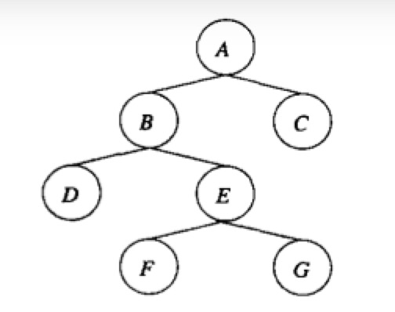

### 基于树协议的封锁的动机

考虑B树索引，这一系统中将单个节点(即块)当做可封锁数据库元素。

如果使用标准的共享，排他和更新锁这样的封锁方式，并且使用两阶段封锁(2PL)，那么B树的并发几乎是不可能的，因为使用索引的事务必须从封锁B树的根节点开始。如果事务是2PL的，那么直到它获得B树节点和其他数据库元素上所需要的锁，事务不能解锁根。由于任何插入或删除的事务可能会重写B树的根，事务至少需要根节点上的一个更新锁，或一个排他锁。因此任何时刻都只有一个非只读的事务访问B树。

但是大多数情况下，B树的根不会被重写，因此，一旦事务观察到根的子节点并排除重写根的可能性的情况，就可以释放根上的锁，同样的规则适用于任何B树的内部节点上的锁。这个规则会违反2PL，因此我们不能确定访问B树的事务的调度室可串行化的。解决方法是为访问像B树这样的树数据结构采用专用的数据结构。这一协议违反2PL，但使用访问元素必须沿树向下这样一个事实来保证可串行。

### 访问树数据结构的规则

假设只有一种锁，由形式为$l_i(X)$的封锁请求表示，这一思路可以推广到其他任何封锁方式集合。假设事务是一致的，并且调度是合法的(即调度器在一个节点上只有与已有锁不冲突时才对该节点授予锁来实施约束)，但事务上没有两阶段提交的要求。

1. 事务的第一个锁可以在树的任何节点上。
2. 只有事务当前在父节点上持有锁时才能获得后续的锁。
3. 节点可以在任何时候解锁。
4. 事务不能对一个它已经解锁的节点重新上锁，即使它在该节点的父节点上仍持有锁。

例：

### 

|      $T_1$       |      $T_2$       |      $T_3$       |
| :--------------: | :--------------: | :--------------: |
| $l_1(A);r_1(A);$ |                  |                  |
| $l_1(B);r_1(B);$ |                  |                  |
| $l_1(C);r_1(C);$ |                  |                  |
| $w_1(A);u_1(A);$ |                  |                  |
| $l_1(D);r_1(D);$ |                  |                  |
| $w_1(B);u_1(B);$ |                  |                  |
|                  | $l_2(B);r_2(B);$ |                  |
|                  |                  | $l_3(E);r_3(E);$ |
| $w_1(D);u_1(D);$ |                  |                  |
| $w_1(C);u_1(C);$ |                  |                  |
|                  |  $l_2(E)$被拒绝  |                  |
|                  |                  | $l_3(F);r_3(F);$ |
|                  |                  | $w_3(F);u_3(F);$ |
|                  |                  | $l_3(G);r_3(G);$ |
|                  | $l_2(E);r_2(E);$ |                  |
|                  |                  | $w_3(G);u_3(G);$ |
|                  | $w_2(B);u_2(B);$ |                  |
|                  | $w_2(E);u_2(E);$ |                  |

### 树协议发挥作用的原因

略