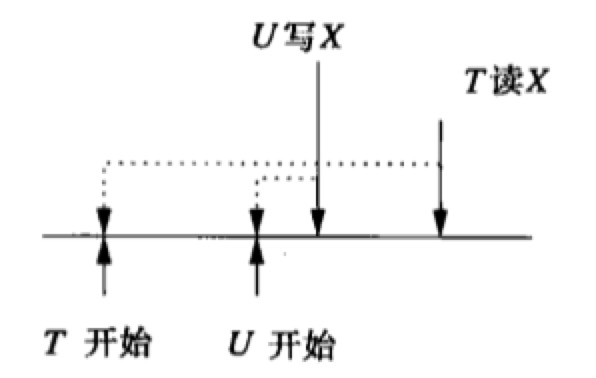
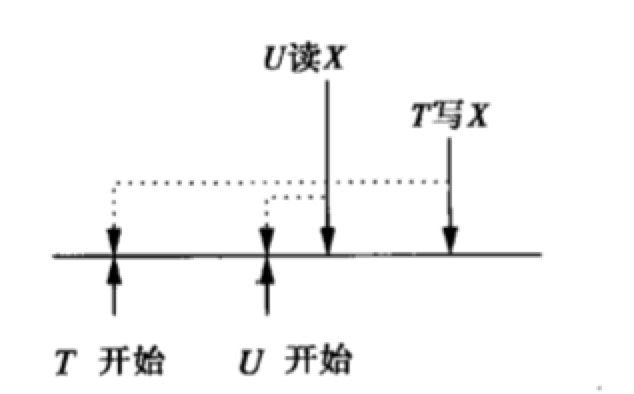
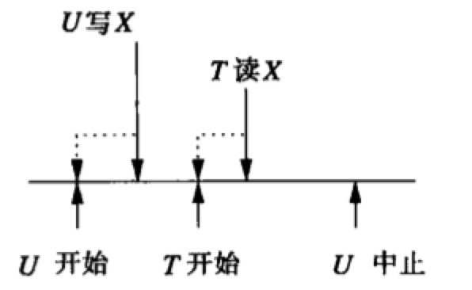
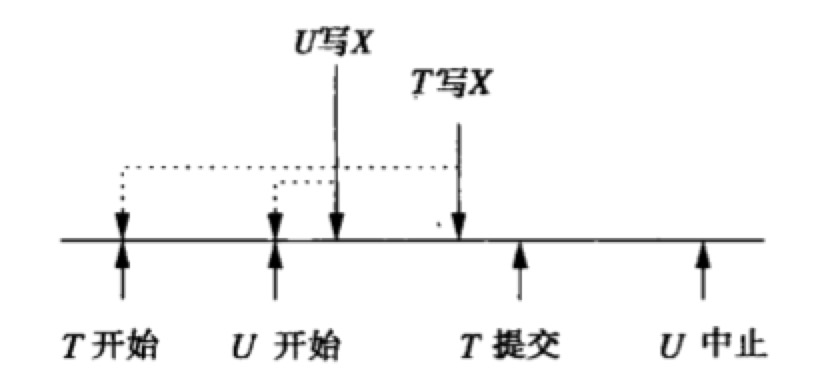

在封锁以外，可以用来保证事务可串行化的两种方法：

1. **时间戳**。为每个事务分配一个时间戳。记录上次读和写每个数据库元素的事务时间戳，将这些数值与事务时间戳比较，根据事务的时间戳以确保串行调度等价于实际事务的调度。
2. **有效性确认**。当要提交一个事务时，检查事务和数据库元素的时间戳；这一过程被称作事务的有效性确认。根据事务的有效性确认时间排列的串行调度必须等同于实际调度。

这两种方法都假设没有非可串行化行为发生，并且只在违例很明显时做修复，在这个意义上它们是**乐观的**。与此相反，所有封锁方法假设如果不预防事务陷入非可串行化行为中，事情就会出错。乐观的方法不同于封锁的地方在于，当确实发生问题时唯一的补救措施是中止并重启参与非可串行化行为的事务。封锁调度器推迟事务，但不中止它们。通常，当很多事务只读时乐观的调度器比封锁好，因为这些事务永远不会导致非可串行化行为。

### 时间戳

为了使用时间戳作为并发控制的方式，调度器需要给每个事务$T$一个唯一的数，即其**时间戳$TS(T)$**。时间戳必须在事务首次通知调度器自己将开始时按升序发出。产生时间戳的两种方法是：

1. 系统时间作为时间戳。
2. 调度器维护一个计数器。每个事务开始时，计数器加$1$，新的值成为该事务的时间戳。

为了使用时间戳作为并发控制方式，我们需要将每个数据库元素$X$与两个时间戳和一个附加位联系起来：

1. $RT(X)$，$X$的读时间，它是读$X$的事务中最高的时间戳。
2. $WT(X)$，$X$的写时间，它是写$X$的事务中最高的时间戳。
3. $C(X)$，$X$的提交位，改位为真，当且仅当最近写$X$的事务已提交。这一位的目的是为了避免出现事务$T$读另一事务$U$所写数据然后$U$中止的情况。$T$读了脏数据。

### 事实上不可乐观的行为

调取器假设事务的时间戳顺序也必须是它们看起来执行的顺序。

可能发生的问题有两类：

1. **过晚的读**：事务$T$试图读数据库元素$X$，但$X$的写时间表明$X$现有的值是$T$理论上执行以后写入的；即$TS(T) <WT(X)$。

   
   事务$U$在事务$T$后开始，但在$T$读$X$前为$X$写入一个值。$T$应该不能读入$U$写入的值，因为理论上$U$在$T$后执行。解决方法是中止$T$。

2. **过晚的写**：事务$T$试图写数据库元素$X$。但是$X$的读时间表明另外的某个事务应该读到$T$写入的值但却读到另外的值。也就是$WT(X) < TS(T) < RT(X)$。

事务$U$在事务$T$后开始，但在$T$有机会写$X$之前读$X$。当$T$试图写$X$时，发现$RT(X) > TS(T)$，意味着$X$已经被一个理论上在$T$执行后的事务$U$所读；还发现$WT(X) < TS(T)$，意味着没有其他事务往$X$写入能覆盖$T$所写的值，因此取消$T$将其值写入$X$这一任务，使$U$能读它。

### 脏数据的问题

提交位是为了解决包括脏读的一类问题。

事务$T$在事务$U$后开始，$T$读$X$在$U$写入$X$之后，但若是$U$被中止，$T$会读到脏数据。最好将$T$读$X$推迟到$U$提交或中止后，通过$C(X)$为假断定$U$尚未提交。
另一种可能的情况是

$TS(T) < TS(U)$并且$U$先写$X$。当$T$试图写$X$时，正确的动作是什么也不做，显然不会有另一个事务应该读$T$的$X$值却读到$U$的值，因为如果$V$试图读$X$，它将因为过晚的读而中止。以后对$V$执行的读将需要$U$的$X$值或者一个更晚写入的$X$值，而不是$T$的。写操作在写时间更晚的写操作已经发生时可以被跳过，称为**Thomas写法则**。
但是Thomas写法则有一个潜在的问题，即如图所示，$U$最后被中止，那么他的$X$应该被删掉，并且恢复前一个值和写时间。由于$T$已提交，$T$写入的$X$值应该被恢复。但是由于跳过$T$的写，已经不能恢复了。
假设基于时间戳的调度器有如下的能力。
* 当事务$T$写数据库元素$X$时，写是尝试性的，且在$T$中止时可以撤销。提交位$C(X)$为假，调度器保存$X$的旧值和原有$WT(X)$的一个拷贝。

### 基于时间戳调度的规则

作为对来自事务$T$的读写请求的反应，调度器可以有如下选择：

1. 同意请求。
2. 中止$T$(如果$T$违背现实)并重启具有新时间戳的$T$(中止再加上重启常称为回滚)。
3. 推迟$T$，并在以后决定是中止$T$还是同意请求(如果请求是读并且此读可能是脏的)。

规则如下：

1. 假设调度器收到请求$r_T(X)$。
   1. 如果$TS(T) \ge WT(X)$，此读是事实上可实现的。
      1. 如果$C(X)$为真，同意请求。如果$TS(T) > RT(X)$，置$RT(X)$；否则不改变$RT(X)$。
      2. 如果$C(X)$为假，推迟$T$直到$C(X)$为真或写$X$的事务回滚中止。
   2. 如果$TS(T) < WT(X)$，此读是事实上不可实现的。回滚$T$，即中止$T$并以一个新的更大的时间戳重启它。
2. 假设调度器收到请求$w_T(X)$。

   1. 如果$TS(T) \ge RT(X)$，且$TS(T) \ge WT(X)$，此写是事实上可实现的且必须执行。

      1. 为$X$写入新值。
      2. 置$WT(X) := TS(T)$。
      3. 置$C(X) := false$。
   2. 如果$TS(T) \ge RT(X)$，但是$TS(T) < WT(T)$，此写事实上是可实现的，但$X$中已有了一个更晚的值

      1. 如果$C(X)$为真，那么前一个$X$的写已提交，我们只要忽略$T$的写。
      2. 如果$C(X)$为假，推迟$T$直到$C(X)$为真或写$X$的事务回滚中止。
   3. 如果$TS(T) < RT(X)$，那么此写是事实上不可实现的，而$T$必须被回滚。
3. 假设调度器收到提交$T$的请求。它必须(使用调度器维护的一个列表)找到$T$所写的所有数据库元素$X$，并且置$C(X):= true$。如果有任何等待$X$提交的事务(从调度器维护的另一个列表找到)，这些事务允许继续进行。
4. 假设调度器收到中止$T$的请求。或者决定回滚$T$。那么任何等待$T$所写元素$X$的事务必须重新尝试读或写，看着一动作在$T$中止后是否合法。

|   $T_1$   |   $T_2$   |   $T_3$   |   $A$    |   $B$    |   $C$    |
| :-------: | :-------: | :-------: | :------: | :------: | :------: |
|    200    |    150    |    175    |  $RT=0$  |  $RT=0$  |  $RT=0$  |
|           |           |           |  $WT=0$  |  $WT=0$  |  $WT=0$  |
| $r_1(B);$ |           |           |          | $RT=200$ |          |
|           | $r_2(A);$ |           | $RT=150$ |          |          |
|           |           | $r_3(C);$ |          |          | $RT=175$ |
| $w_1(B);$ |           |           |          | $WT=200$ |          |
| $w_1(A);$ |           |           | $WT=200$ |          |          |
|           | $w_2(C);$ |           |          |          |          |
|           |   中止    |           |          |          |          |
|           |           | $w_3(C);$ |          |          |          |

### 多版本时间戳

多版本时间戳调度器和时间戳调度器的差别有以下几方面：

1. 当新的写$w_T(X)$发生时，如果它合法，那么数据库元素$X$的一个新版本被创建。其写时间为$TS(T)$，并且我们用$X_t$来指代它，其中$t=TS(T)$。
2. 当读$r_T(X)$发生时，调度器找到$X$的版本$X_t$，它满足$t \le TS(T)$，并且不存在满足$t < t' \le TS(T)$的版本$X_{t'}$。即$T$读取的是$T$之前最新写入的版本。
3. 写时间与元素的版本相关，且永不改变。
4. 读时间也与元素的版本相关。例如，拒绝$TS(T) < RT(X_t)$的写操作。
5. 当版本$X_t$的写时间$t$满足任何活跃事务的时间戳都不小于$t$时，就可以删除$X$的任何早于$X_t$的版本。

### 时间戳与封锁

大多数事务只读或者并发事务极少试图读写同一元素的情况下，时间戳通常比较优越。

在高冲突的情况下，封锁的性能比较好。

* 封锁在事务等待锁时通常推迟事务。
* 但如果并发事务频繁读写公共元素，那么回滚在一个时间戳调度器中就会很频繁，导致甚至比封锁系统中更多的延迟。