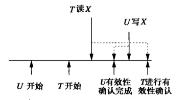
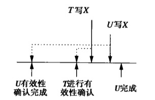
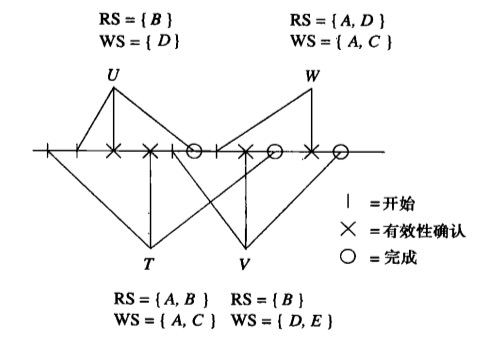

有效性确认是一种乐观的并发控制类型，允许事务不经封锁访问数据，而是在适当的时候检查事务是否以一种可串行化的方式运转。有效性确认和时间戳的主要区别是调度器维护关于活跃事务正在做什么，而不是为所有数据库元素保存读时间和写时间。事务开始为数据库元素写入值前的一刹那，它经过一个有效性确认阶段，这时用它已经读的和将写的元素集合与其他活跃事务的写集合作比较。如果存在事实上不可实现行为的风险，该事务就回滚。

### 基于有效性确认调度器的结构

当有效性确认被用作并发控制机制时，对每个事务$T$，调度器必须告知$T$所读和写的数据库元素集合，分别是读集合$RS(T)$和写集合$WS(T)$。事务分三个阶段来执行：

1. **读**：事务从数据库中读其读集合中的所有元素。事务还在局部地址空间中计算它将要写的所有值。
2. **有效性确认**：调度器通过比较该事务与其他事务的读写集合来确认该事务的有效性。如果有效性确认失败，则事务回滚，否则继续进入下一阶段。
3. **写**：事务往数据库中写入其集合中元素的值。

为了支持做出是否确认事务有效性的决定，调度器维护三个集合：

1. $START$，已经开始但尚未完成有效性确认的事务集合。对这个集合中的每个事务$T$，调度器维护$START(T)$，即事务$T$开始的时间。
2. $VAL$，已经确认有效性但尚未完成写的事务。对这个集合中的每个事务$T$，调度器维护$START(T)$和$VAL(T)$，即$T$确认的时间。$VAL(T)$也是假设的串行执行顺序中所设想的$T$的执行时间。
3. $FIN$，已完成写的事务。对这样的事务，调度器记录$START(T)$、$VAL(T)$和$FIN(T)$，即$T$完成的时间。原则上这个集合将一直增长。但是，如果对任意活跃事务$U$(即对任何在$START$或$VAL$中的$U$)，事务$T$满足$FIN(T) < START(U)$，这样的$T$我们不必记住。调度器因此可以周期性的清理$FIN$集合，以防止其一直增大。

### 有效性确认规则

1. 假设存在事务$U$满足：

   1. $U$在$VAL$或$FIN$中；即$U$已经过有效性确认。
   2. $FIN(U) > START(T)$；即$U$在$T$开始前没有完成。
   3. $RS(T) \cap WS(T) \ne \varnothing$；设其包含数据库元素$X$。

   那么$U$可能在$T$读$X$后写$X$。事实上，$U$甚至可能还没有写$X$。$U$写了$X$但并不及时的一种情况。由于$T$是否读到$U$是未知的，所以我们必须回滚$T$以避免$T$和$U$的动作与假设串行顺序不一致的风险。

   

2. 假设存在事务$U$满足：
   1. $U$在$VAL$中；即$U$已经完成有效性确认。
   2. $FIN(U) > VAL(T)$；即$U$在$T$进入其有效性确认阶段以前没有完成。
   3. $WS(T) \cap WS(T) \ne \varnothing$；设其包含数据库元素X。

   这时$T$和$U$都必须写$X$的值，如果我们确认$T$的有效性，它就可能在$U$前写$X$。由于不确定，我们必须回滚$T$以保证它不会违反假设的$T$在$U$后的串行顺序。

   

有效性确认的规则：
* 对于所有已经经过有效性确认且在$T$开始前没有完成的$U$，即对于满足$FIN(U) > START(T)$的$U$，检测是否$RS(T) \cap WS(U) = \varnothing$。
* 对于所有已经经过有效性确认且在$T$有效性确认前没有完成的$U$，即对于满足$FIN(U) > VAL(T)$的$U$，检测是否$RS(T) \cap WS(U) = \varnothing\ and\ WS(T) \cap WS(U) = \varnothing$。
例：

1. $U$的有效性确认：当确认$U$的有效性时没有其他已确认事务，因此不需要检测，$U$的有效性检测成功并为数据库元素$D$写入一个值。

2. $T$的有效性确认：当确认$T$的有效性是，$U$已确认但未完成。因此，我们必须检测$T$的读写集合是否都满足与$WS(U) = {D}$没有公共元素。由于$RS(T) = {A, B}\ WS(T) = {A,C}$，因此，确认$T$的有效性。

3. $V$的有效性确认：当确认$V$的有效性时T,$U$已确认和完成，$T$已确认但尚未完成，并且$V$在$U$完成前开始。因此，用$RS(V)$和$WS(V)$来和$WS(T)$来完成，用$RS(V)$和$WS(U)$比较，我们发现：
  * $RS(V)\cap WS(T) = \{B\} \cap \{A, C\} = \varnothing$
  * $WS(V)\cap WS(T) = \{D,E\} \cap \{A,C\} = \varnothing$
  * $RS(V)\cap WS(U)= \{B\}\cap\{D\} = \varnothing$ 

  因此，$V$的有效性也成功确认。

4. $W$的有效性确认：当确认$W$的有效性时，$U$在$W$开始前已经结束，因此不比较。$FIN(T) > START(W)$，$FIN(T) < VAL(W)$，因此比较$RS(W)$和$WS(T)$。$FIN(V) > VAL(W)$。因此用$RS(W)\ WS(W)$和$WS(V)$来比较。

   * $RS(W) \cap WS(T) = \{A,D\} \cap \{A,C\} = \{A\}$
   * $RS(W) \cap WS(V) = \{A,D\} \cap \{D,E\} = \{D\}$
   * $WS(W)\cap WS(V) = \{A,C\} \cap \{B\} = \varnothing$

   $W$被回滚。

###三种并发机制的比较

存储：

* **封锁**：锁表空间与被封锁元素个数成正比。
* **时间戳**：将最早的活跃事务以前的所有时间戳看做负无穷，这样，我们可以类似锁表那样将读时间和写时间记录在一张表中，其中只给出那些最近已经被访问过的数据库元素。
* **有效性确认**：空间用于每个当前活跃事务以及少量几个在某当前活跃事务开始后完成的事务的时间戳和读/写集合。

因此，每种方法使用的空间数量大致正比于所有活跃事务访问的数据库元素总和。时间戳和有效性确认可能使用空间略微多一些。

* 封锁推迟事务但避免回滚。时间戳和有效性确认不推迟事务，但能导致其回滚，浪费资源。
* 相互影响低时，时间戳和有效性确认比封锁开销小。
* 当回滚必要时，时间戳比有效性确认更早的捕获问题。