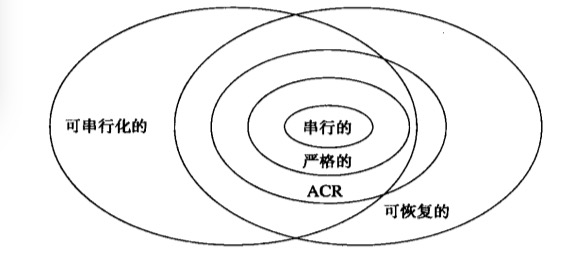

## 可串行性和可恢复性

### 脏数据问题

如果数据被未提交事务写入，那么该数据就是脏的。

### 级联回滚

如果事务可以获得脏数据，那么有时候我们需要执行**级联回滚**。当事务$T$中止时，我们必须确定哪些事务读取了由$T$写入的数据，中止这些事务，然后递归地中止读了被中止事务所写数据的所有事务。使用提交位的基于时间戳的调度器和基于有效性确认的调度器都能避免级联回滚。

### 可恢复的调度

如果调度中每一个事务都在它所读取的所有事务提交之后才提交，则该调度是**可恢复的**。

日志的提交记录到达磁盘的顺序必须和它们被写入的顺序一致。

### 避免级联回滚的调度

如果调度中的事务只读取已提交事务写入的数据，则称该调度为**避免级联回滚(avoid cascading rollback)**的调度(或$ACR$调度)。

每一个$ACR$调度都是可恢复的。

### 基于锁对回滚的管理

有一种简单常用的方法可以保证不产生级联回滚：

* **严格封锁**：直到事务提交或中止且提交或中止日志记录已被刷新到磁盘之后，事务才允许释放排他锁(或其他允许值发生改变的锁，如增量锁)。

遵守严格封锁规则的事务调度被称为**严格调度**。这种调度有两个重要的特性：

1. 每一个严格调度都是$ACR$调度。这是因为$T_2$无法读取$T_1$所写入的元素$X$的值，直到$T_1$释放所有的排他锁。
2. 每一个严格调度都是可串行化的。

修复缓冲数据的难度依赖于数据库元素是块还是更小的东西。

#### 块的回滚

如果可封锁数据库元素是块，那么不需要日志即可回滚。

* 未提交事务所写的块被钉在主存里，不允许写入到磁盘。

如果使用的是多版本系统，那么必须假设未提交事务所写的块在内存里，我们只需从$A$的可用列表中去掉$T$所写入的值即可。

#### 小的数据库元素的回滚

当我们需要恢复中止事务修改过的一个小的数据库元素$A$的旧值时，有以下几种选择：

1. 从存储在磁盘的数据库中读取$A$原来的值，并对缓冲区内容做适当的修改。
2. 如果日志是undo或undo/redo日志，那么我们可以从日志中获取修改前的值。
3. 我们可以为每个事务所做的修改维护一个单独的主存日志，该日志仅在对应事务活跃时保留。旧值可以从这一日志获得。

### 成组提交

* 在事务完成且提交日志记录至少出现在缓冲区中以前不能释放锁。
* 日志记录按创建的顺序刷新。

### 逻辑日志

当数据库元素是块时至少有两个问题：

1. 所有日志方式都要求在日志中记录数据库元素的新值、旧值或二者都记录。如果块中变化较小，那么有大量冗余数据写入日志中。
2. 对于调度可恢复的要求，即只有提交后才能释放锁，会严重抑制并发性。

**逻辑日志**中只描述块中的变化。

1. 数据库元素的少量字节改变，例如更新一个定长字段。
2. 数据库元素的改变描述简单，易于恢复，但它产生的影响是改变了该数据库元素的大多数或全部字节。一种常见的情况是，记录一个变长字段改变，该记录的大部分甚至其他记录需要在块内滑动。
3. 变化影响到数据库元素的很多字节，且进一步的改变可能使这一变化变的不可撤销。这种情况是真正的逻辑日志，因为我们不能将undo/redo日志过程视为发生在数据库元素上，而应视为发生在数据库元素所代表的高层逻辑结构上。

###从逻辑日志中恢复

**日志序号**

* 每条日志被赋予比前一条记录大1的编号。一条典型的逻辑日志记录的形式为$<L,T,A,B>$，其中：
  * $L$是表示日志序号的整数。
  * $T$是涉及的事务
  * $A$是事务的动作，例如，插入元组$t$
  * $B$是执行事务的块。
* 对于每一种动作，都用一个**补偿**动作来在逻辑上对这个动作进行undo。例如，“插入元组$t$”的补偿动作为“删除元组$t$”。
* 如果事务$T$中止，$T$执行的每一个动作的补偿动作都会被执行，而补偿动作的动作也会被记录到日志中。
* 每一个块在块首维护最后对该块产生影响的动作的日志序号。

假设我们现在需要在系统崩溃后利用逻辑日志进行恢复。下面是对需要采取的步骤的概述。

1. 对崩溃时数据库的状态进行重建，包括当前的数据值在缓冲中因而被丢失的块。我们要做的是：
   1. 找到日志中最近的检查点，并由它确定当时处于活动状态的事务的集合。
   2. 对于每一条日志记录$<L,T,A,B>$，比较块上的日志序号$N$和当前日志记录的日志序号$L$。如果$N<L$，则redo动作$A$；该动作没有在块$B$上执行。反之，当$N\ge L$时，就什么也不做；动作$A$已经对块$B$产生了影响。
   3. 当遇到所有关于事务$T$开始、提交或是中止的日志记录，对活动事务集合进行相应的调整。
2. 当我们到达日志结束位置时事务集合中依旧处于活动状态的事务需要被中止。我们要做的是：
   1. 再次对日志进行扫描，这次扫描从末尾逐个向前直到上一个检查点。每当我们遇到一个需要被中止的事务$T$的日志记录$<L,T,A,B>$，在块$B$上执行补偿动作，并将补偿动作的执行记录到日志中。
   2. 如果我们需要中止一个在最近的检查点之前开始的事务，那么继续向前扫描日志直到每个事务的起始记录都被找到。
   3. 为每一个需要中止的事务在日志中写入中止的记录。