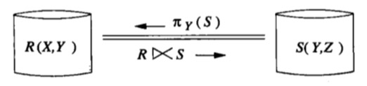
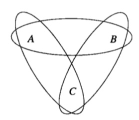
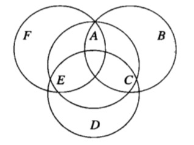

## 分布式查询处理

### 分布式连接操作问题

假设我们要计算$R(A, B) \Join S(B,C)$，$R$和$S$位于网络的不同节点上。有两个明显的方法计算连接。

1. 把$R$的一个副本传送给$S$所在的节点，然后在$S$所在的节点上计算连接。
2. 把$S$的一个副本传给$R$所在的节点，然后在$R$所在的节点上计算连接。

###半简化连接
$R(X,Y)$和$S(Y,Z)$的半连接是$R\ltimes S = R\Join (\pi_{Y}(S))$，其中$X$，$Y$，$Z​$都是属性的集合。

如果满足下面至少一个条件，$\pi_Y(S)$就会比$S$小
1. 有许多重复需要消除，即$Y$中很多元组的$Y$属性值相同。
2. 属性$Z$的内容比属性$Y$的内容大，例如$Z$包含的属性值是音频、视频或文档。

为确认半连接计划优于其他查询计划，我们还需要知道$R\ltimes S$的大小比$R$要小，也就是说，$R$在它的连接操作中必须包含很多悬挂元组。

###多个关系的连接
对不同节点上的两个以上关系做自然连接或等值连接时，发生了以下奇怪的事。

* 把这些关系传送到其他站点做连接之前，可能需要做多个半连接来消除关系中的悬挂元组。
* 对一些关系模式集合，不存在有限的半连接操作序列来消除所有的悬挂元组。
* 有可能识别那些可利用半连接在有限步骤内消除悬挂元组的关系模式的集合。

消除所有的悬挂元组，称这样的半连接序列为关系的完全化简。
###非循环超图
$R(A,b)$，$S(B,C)$，$T(A,C)$的超图，有环，使它不存在完全化简。

$R(A,E,F)$，$S(A,B,C)$，$T(C,D,E)$和$U(A,C,E)$的超图，是一个非循环超图。

一个超边$H$是一个**耳朵**，若在同一个超图中存在另外的超边$G$使$H$中的每个节点满足下列情况之一：
1. 仅包含在$H$中。
2. 也包含在$G$中。

称$G$消费$H$。
在上图中，超边$H={A,E,F}$是一个耳朵，$G$的角色由${A,C,E}$来担任。节点$F$是$H$独有的，它在其他超边中不存在。$H$的另外两个节点$A$和$E$也是$G$的成员。

###非循环超图的完全化简
**基础** 如果只有一个超边，什么也不做。一个关系的连接是这个关系自己，肯定没有悬挂元组。
**归纳** 如果超图的超边个数大于$1$，那么它一定至少有一个耳朵。选择其一，记作$H$，且假设它被超边$G$消费。
1. 执行半连接$G := G \ltimes H$，也就是从$G$中消除那些与$H$没有连接的元组。
2. 递归地为去掉$H$的超图找到一个半连接序列。
3. 执行半连接$H := H \ltimes G$